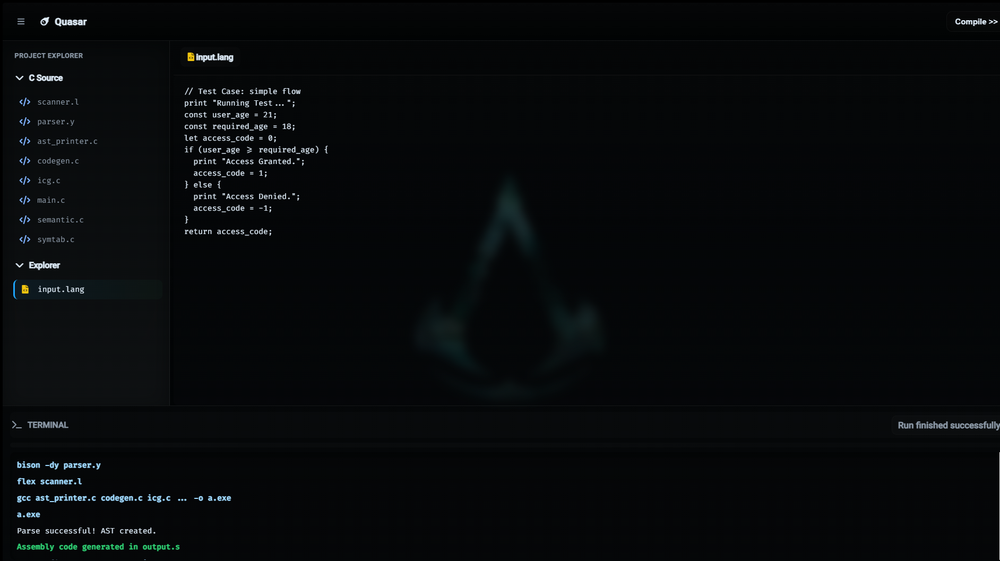
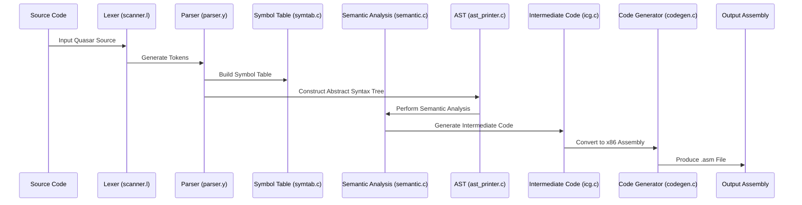

<div align="center">

# ☄️ Quasar Compiler

[](LICENSE)
[](https://gcc.gnu.org/)
[](https://www.nasm.us/)
[](https://github.com/westes/flex)
[](https://www.gnu.org/software/bison/)
[](https://en.wikipedia.org/wiki/X86)
[](https://github.com/Siddhantbht02/Quasar-Compiler/releases)
[](https://github.com/Siddhantbht02/Quasar-Compiler/actions)
[](https://github.com/Siddhantbht02/Quasar-Compiler/actions)
[](https://codecov.io/gh/Siddhantbht02/Quasar-Compiler)

> A complete, multi-phase compiler for the Quasar programming language, translating a custom C-like high-level language into executable 32-bit x86 assembly code.

</div>

---

## IDE View

<div align="center">
  
</div>


## Overview

The Quasar Compiler is a comprehensive implementation of modern compiler theory, demonstrating the entire compilation pipeline from source code tokenization to machine code generation. This project serves as an educational tool for computer science students, a portfolio piece for aspiring systems programmers, and a reference for language design enthusiasts.

## The Quasar Language

Quasar is a small, statically-typed procedural language with syntax familiar to C, Java, and JavaScript developers. It emphasizes clarity and simplicity while maintaining robust type safety.
### Language Features

| Category | Feature | Syntax & Description |
|----------|---------|----------------------|
| **Variables & Types** | Data Types | `Int` (integers), `Dub` (floating-point), `Bool` (true/false) |
| | Variable Declaration | `let my_var = 10;` (mutable) |
| | Constant Declaration | `const PI = 3.14;` (immutable) |
| | String Literals | Supported for output via `print` |
| **Operators** | Arithmetic | `+`, `-`, `*`, `/`, `%` |
| | Relational & Equality | `==`, `!=`, `<`, `>`, `<=`, `>=` |
| | Logical | `&&` (AND), `\|\|` (OR), `!` (NOT) |
| | Assignment | `=`, `+=`, `-=`, `*=`, `/=`, `%=` |
| | Increment/Decrement | `++`, `--` (prefix and postfix) |
| **Control Flow** | Conditionals | `if-else` statements with nesting support |
| | Loops | `for` and `while` loops |
| | Loop Control | `break` and `continue` statements |
| **Built-in Functions** | Output | `print "Hello, World!";` |
| | Program Exit | `return` statement with integer exit code |## Sample Programs

### Example 1: for Loop with break

```quasar
// File: examples/for_loop_break.lang

print "--- Starting Calculation ---";

const THRESHOLD = 100;
let final_result = 0;

for (let i = 1; i <= 10; i = i + 1) {
    final_result = final_result + (i * 5);

    if (final_result > THRESHOLD) {
        print "Threshold exceeded!";
        break;
    }
}

print "--- Calculation Complete ---";
return final_result;
```

### Example 2: Nested if-else with Logical Operators

```quasar
// File: examples/nested_if.lang

print "--- Program Start ---";

const score_math: Int = 90;
const score_science: Int = 78;
const passing_grade: Int = 60;
let extra_credit: Int = 5;
let final_status: Int = 0;

if (score_math >= passing_grade) {
    print "Math score is passing.";

    if ((score_science + extra_credit) > 80 && score_math > 85) {
        print "Science score with extra credit is also excellent.";
        final_status = (score_math * 2) - (score_science % 10);
    } else {
        print "Science score is good, but not in the top tier.";
        final_status = -1;
    }
} else {
    print "Math score is failing.";
    final_status = -99;
}

print "--- Program End ---";
return final_status;
```

## Compiler Architecture

The Quasar Compiler implements a classic five-phase compilation pipeline:

```
Source Code → [Lexer] → Tokens → [Parser] → AST → [Semantic Analyzer] → 
Annotated AST → [ICG] → TAC → [Code Generator] → Assembly
```

### Compilation Phases

1. **Lexical Analysis (Flex)**: Scans source text and converts it into a token stream
2. **Syntax Analysis (Bison)**: Validates tokens against language grammar and builds an Abstract Syntax Tree (AST)
3. **Semantic Analysis**: Performs type checking and scope resolution using a Symbol Table, annotating the AST
4. **Intermediate Code Generation (ICG)**: Translates annotated AST into machine-independent Three-Address Code (TAC)
5. **Final Code Generation**: Converts TAC into executable 32-bit x86 assembly code (AT&T syntax)

## Building and Running

### Prerequisites

- 32-bit MinGW environment (MSYS2 recommended for Windows)
- Flex (lexical analyzer generator)
- Bison (parser generator)
- GCC (GNU Compiler Collection)

### Build Instructions

Execute the following commands in the project's root directory:

#### Step 1: Generate Parser and Scanner

```bash
bison -dy parser.y
```
 ```ssh
flex scanner.l
```

#### Step 2: Build the Quasar Compiler

```bash
gcc y.tab.c lex.yy.c symtab.c semantic.c ast_printer.c icg.c codegen.c
```

This produces `a.exe` (the Quasar compiler executable).

#### Step 3: Compile a Quasar Program

```bash
./a.exe
```

This reads `input.lang` and generates `output.s` (assembly file).

#### Step 4: Build the Final Executable

```bash
gcc -m32 -o final_program.exe main.c output.s
```

#### Step 5: Run Your Program

```bash
./final_program.exe
```

## Project Structure




